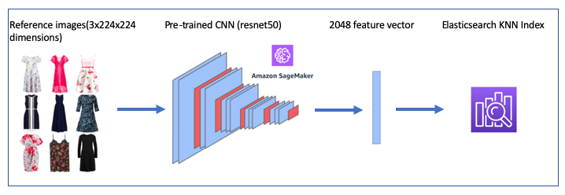
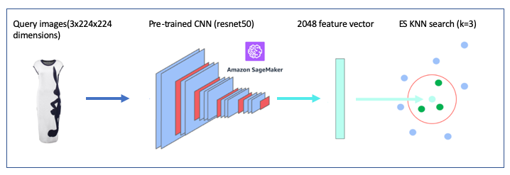

## Visual image search
This repository is [part of AWS blog](https://aws.amazon.com/blogs/machine-learning/building-a-visual-search-application-with-amazon-sagemaker-and-amazon-es/) to create a visual search application using Amazon SageMaker and Amazon Elasticsearch

## How does it work?

We will use Fashion Images from feidegger, a zalandoresearch dataset as a reference image to generate a 2048 feature vector using a convolutional neural networks and gets stored into Amazon Elasticsearch KNN index

When we present a new query image, it's computing the related feature vector from Amazon SageMaker hosted model and query Amazon Elasticsearch KNN index to find similar images

## Deploy

You use a CloudFormation stack to deploy the solution. The stack creates all the necessary resources, including the following: 

 + An Amazon SageMaker notebook instance to run Python code in a Jupyter notebook
 + An IAM role associated with the notebook instance
 + An Amazon ES domain to store and retrieve image embedding vectors into a KNN index
 + Two S3 buckets: one for storing the source fashion images and another for hosting a static website

From the Jupyter notebook, you also deploy the following: 

 + An Amazon SageMaker endpoint for getting image feature vectors and embeddings in real time.
 + An AWS SAM template for a serverless back end using API Gateway and Lambda.
 + A static front-end website hosted on an S3 bucket to demonstrate a real-world, end-to-end ML application. The front-end code uses ReactJS and the Amplify JavaScript library.

To get started, complete the following steps: 

  1. Sign in to the [AWS Management Console](https://aws.amazon.com/console/) with your IAM user name and password.
  2. Choose **Launch Stack** and open it in a new tab: 
    

    

  
  3. Wait for the stack to complete executing. 
    When the stack creation is complete, you see the status **CREATE_COMPLETE**. 
    You can look on the **Resources** tab to see all the resources the CloudFormation template created.

  4. On the **Outputs** tab, choose the **SageMakerNotebookURL** value. 
     This hyperlink opens the Jupyter notebook on your Amazon SageMaker notebook instance that you use to complete the rest of the lab.

    

   5. You should be on the Jupyter notebook landing page. 
      Choose **visual-image-search.ipynb.**  
      Select the kernel as `conda_tensorflow_p36`

## License

This library is licensed under the MIT-0 License. See the LICENSE file.
